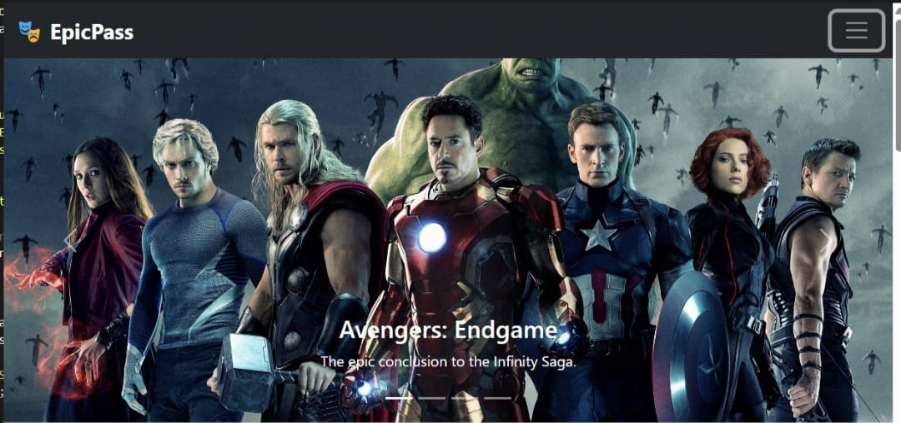
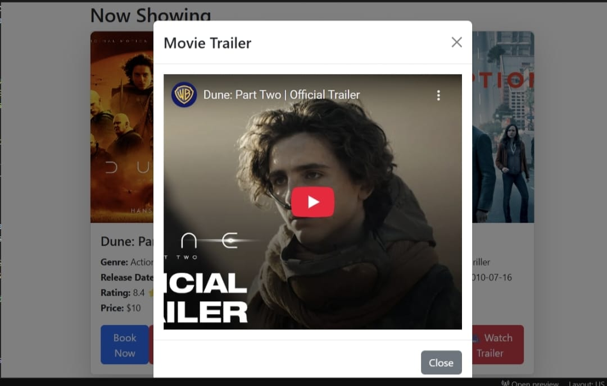
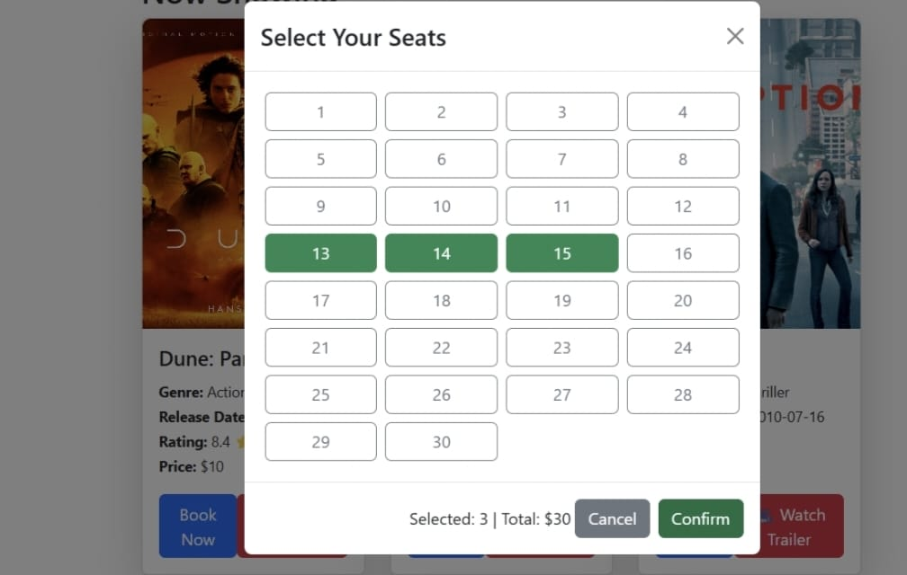
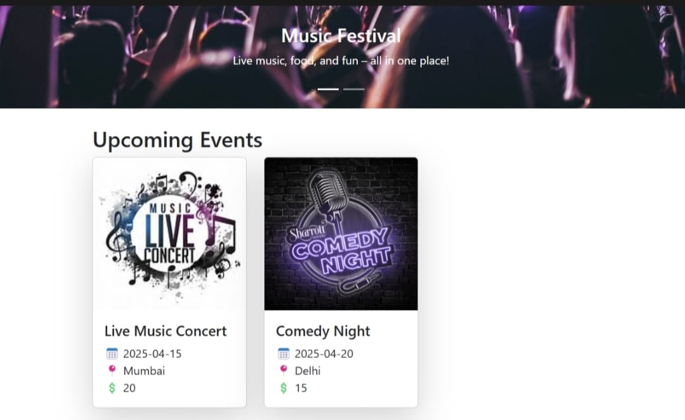
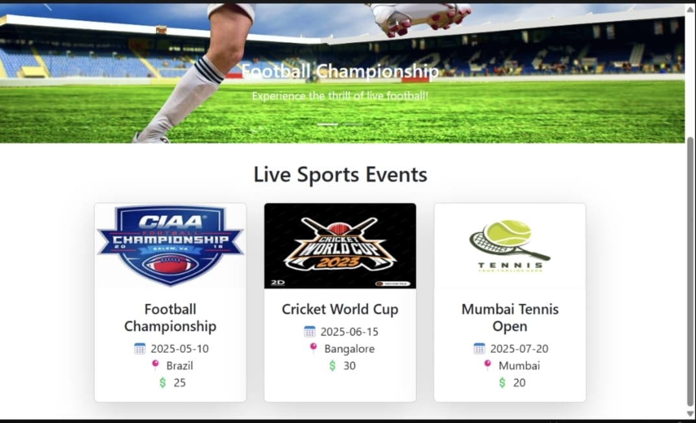
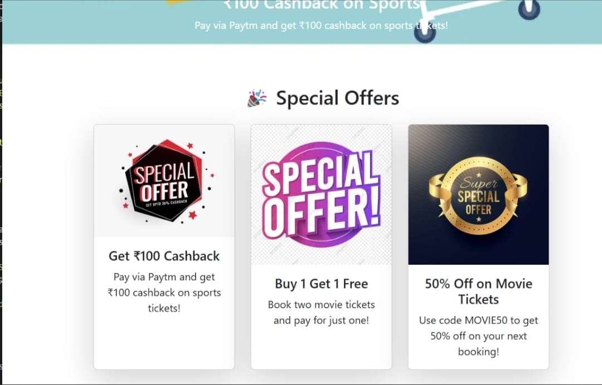

# 🎮 EpicPass (Frontend)

EpicPass is a modern movie ticket booking platform built with **React.js** and **Bootstrap**. It provides an interactive UI with movie listings, trailers, seat selection, dark mode, and more.

---

## 📸 Screenshots

### 🏠 Home Page

 

The landing page displays the latest movies, events, and special offers.


### 🎭 Movie Details Page

 

Users can browse available movies with their posters, genres, and ratings.
Detailed information about a movie, including trailers, cast, and synopsis.

### 🎟️ Seat Selection

 

An interactive seat selection interface for booking movie tickets.

### 🌙 Dark Mode

Easily switch between light and dark themes for better user experience.

### 🍿️ Events Page

 

Find and explore information about concerts, plays, and other live events.

### 🏆 Sports Section

 

Stay updated with live sports events, schedules, and details.

### 🎁 Offers Page

 

Check out special discounts and promotional offers on movie tickets and events.

---

## ✨ Features

👉 **Now Showing Section** – Displays currently available movies with genre, release date, rating, and price.\
👉 **Movie Trailers** – Watch trailers before booking.\
👉 **Dark Mode Toggle** – Switch between light and dark themes.\
👉 **Seat Selection System** – Choose seats while booking tickets.\
👉 **Navigation Bar** – Browse different sections like movies, events, sports, and offers.\
👉 **User Authentication** – Login and register functionality.\
👉 **Search Functionality** – Quickly find movies, events, and sports.\
👉 **Responsive Design** – Fully optimized for mobile and desktop.

---

## 🛠 Tech Stack

- ⛒️ React.js
- 🎨 Bootstrap
- 🛯 React Router
- 🔒 Local Storage (for authentication)

---

## 🚀 Installation & Setup

### 1️⃣ Clone the Repository:

```bash
git clone https://github.com/pruthvishetty1789/EpicPass.git
```

### 2️⃣ Navigate to Project Directory:

```bash
cd EpicPass
```

### 3️⃣ Install Dependencies:

```bash
npm install
```

### 4️⃣ Start the Development Server:

```bash
npm start
```

The app will run at:\
📞 `http://localhost:3000/`

---

## 👨‍💻 Usage

- Open the app in your browser.
- Browse movies, watch trailers, and book tickets!
- Check out events, sports, and special offers.
- Enjoy a seamless movie exploration experience.

---

## 🤝 Contributions

Contributions are **welcome**! If you'd like to improve the project:

1. **Fork** the repository
2. **Create a new branch** (`git checkout -b feature-branch`)
3. **Commit your changes** (`git commit -m "Added new feature"`)
4. **Push to your branch** (`git push origin feature-branch`)
5. **Open a Pull Request`

---

## 🐏 License

This project is licensed under the **MIT License**.


